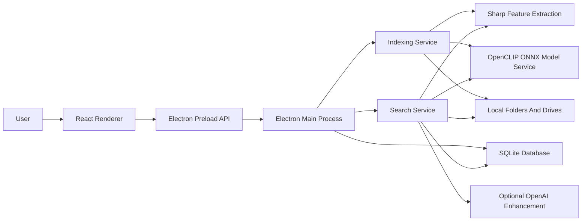
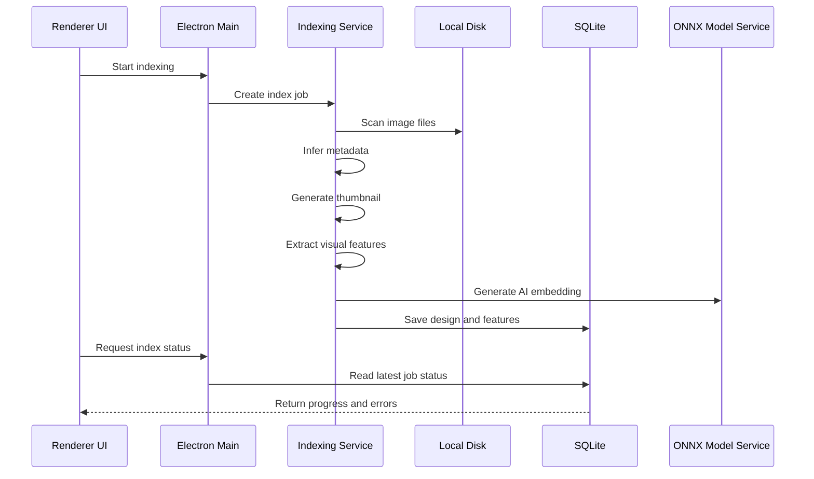
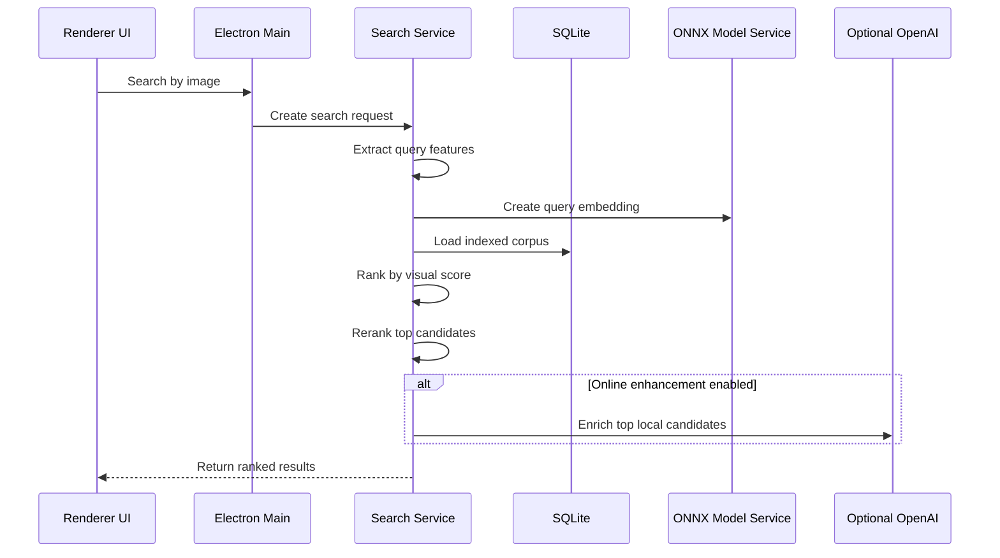

# Fabric Design Finder Architecture

## Summary

Fabric Design Finder is an offline-first Electron desktop app. It uses a React renderer for the workbench UI, an Electron main process for local disk access and native shell actions, SQLite for persistent indexing, Sharp for image preprocessing, and an OpenCLIP-compatible ONNX model for local AI image embeddings.

Core search works without internet access. OpenAI API support is optional and limited to online enrichment of a small set of already-matched local results.

## Runtime Architecture



Standalone Mermaid file: [docs/diagrams/runtime-architecture.mmd](diagrams/runtime-architecture.mmd).

## Main Subsystems

### Renderer

The renderer lives under `src/renderer/` and is responsible for the desktop user experience:

- Search screen for query image and match results.
- Library screen for scan roots and indexing progress.
- Settings screen for thresholds, model status, and optional OpenAI configuration.
- Local image display through preload-backed data URLs so thumbnails render in dev and packaged builds.

The renderer does not directly access Node.js, the filesystem, or SQLite.

### Preload API

The preload bridge lives under `src/preload/`. It exposes a narrow `window.fabricFinder` API to the renderer using Electron `contextBridge`.

Important API groups:

- `pickImage`
- `pickRoots`
- `startIndex`, `pauseIndex`, `resumeIndex`, `cancelIndex`, `getIndexStatus`
- `searchByImage`
- `openFile`, `openFolder`
- `getImageDataUrl`
- `getLibraryStats`
- `getSettings`, `updateSettings`

### Electron Main Process

The main process lives under `src/main/`. It owns:

- native file/folder dialogs
- IPC handlers
- local file reads
- shell actions
- service initialization
- SQLite database location
- packaged model resource lookup

The SQLite database and thumbnails are stored under Electron `app.getPath("userData")`.

Typical locations:

- macOS: `~/Library/Application Support/Fabric Design Finder`
- Windows: `%APPDATA%\Fabric Design Finder`

## Indexing Flow



Standalone Mermaid file: [docs/diagrams/indexing-flow.mmd](diagrams/indexing-flow.mmd).

Supported image formats:

- `.jpg`
- `.jpeg`
- `.png`
- `.webp`
- `.bmp`
- `.tif`
- `.tiff`

## Metadata Inference

Metadata is inferred from folder and file names.

Example:

```text
Jacquard Floral/D12345 Blue Variant.jpg
```

Produces:

```text
Design number: D12345
Design name:   Jacquard Floral
Variant:       Blue Variant
```

This is implemented in `src/main/services/metadata.ts`.

## Search Flow



Standalone Mermaid file: [docs/diagrams/search-flow.mmd](diagrams/search-flow.mmd).

## Matching Strategy

The matching engine uses a hybrid local strategy:

- Color histogram
- Grayscale distribution
- Region color layout
- Edge orientation features
- Texture features
- Perceptual hash
- OpenCLIP-compatible ONNX embedding

Fast features provide broad candidate retrieval. AI embeddings rerank the top candidates. If `model.onnx` is not present, the app uses a deterministic local projection fallback so search remains testable.

## Database Design

SQLite stores the local index.

Primary tables:

- `scan_roots`: selected folders or drives.
- `designs`: inferred metadata, image path, dimensions, thumbnail path, timestamps.
- `image_features`: fast vector, AI embedding, perceptual hash, feature/model versions.
- `index_jobs`: indexing status, progress, current file, failures.
- `settings`: similarity threshold, OpenAI API key, online enhancement flag.

Feature vectors are stored as binary Float32 blobs to keep the database compact and fast enough for large libraries.

## Offline And Online Boundaries

Offline by default:

- folder/drive scanning
- thumbnail creation
- metadata inference
- SQLite storage
- local image matching
- ONNX model inference

Optional online mode:

- OpenAI API enrichment of top local matches only
- no full library upload
- no dependency on OpenAI for core search

## Packaging Architecture

Electron Builder packages:

- compiled Electron main/preload code from `dist/main`
- built React renderer from `dist/renderer`
- app metadata from `package.json`
- model assets from `assets/models`
- native modules unpacked from ASAR:
  - `better-sqlite3`
  - `sharp`
  - `onnxruntime-node`

Windows installer target:

```text
NSIS x64 installer
```

Command:

```bash
npm run dist:win
```

Output:

```text
release/Fabric Design Finder Setup 0.1.0.exe
```

## Validation Checklist

macOS functional testing:

- `npm run dev`
- add folder
- index images
- search by uploaded image
- verify thumbnails render
- verify match ranking
- run `npm run test`
- run `npm run build`

Windows installer testing:

- run `npm run dist:win` on Windows
- install generated `.exe`
- scan a folder
- scan a full drive such as `D:\`
- search with known sample images
- verify open file/open folder actions
- verify uninstall behavior

## Known Production Follow-Ups

- Add the production `assets/models/openclip/model.onnx` file.
- Validate performance with a real 50k to 250k image library.
- Add optional metadata import if design records later come from Excel or CSV.
- Add code signing for Windows installer distribution.
